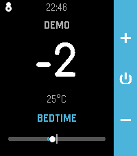
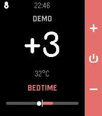
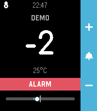
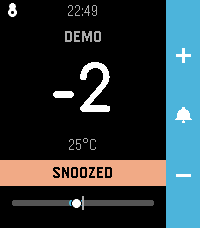
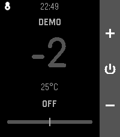
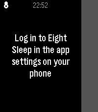
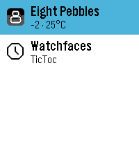

# Eight Pebbles

Control your Eight Sleep mattress from your wrist. Built for the Pebble
Time 2 (emery, 200×228 color), designed around one use case: nudging the
bed temperature at 3am without reaching for your phone.

| Launch | Cooling | Warming | Alarm | Snoozed | Off | First run | Launcher |
|:---:|:---:|:---:|:---:|:---:|:---:|:---:|:---:|
|  |  |  |  |  |  |  |  |

## What it does

- **Up / Down** — warmer / cooler by one step. Hold to ramp. The number
  updates instantly; presses are debounced into a single API call 400ms
  after the last one. Adjust in the Eight Sleep app's −10…+10 levels or
  directly in degrees (°C/°F) — your pick in the settings.
- **Select** — dismiss a ringing/snoozed alarm (a red ALARM banner while
  ringing, a yellow SNOOZED banner while snoozed, plus a bell icon whenever
  one is active). With no alarm: refresh (also re-resolves your bed side if
  the cached mapping went stale).
- **Long Select** — snooze a ringing alarm (5/10/15 min, configurable);
  otherwise toggle your side on/off.
- Big high-contrast level readout, warm (orange) / cool (cerulean) theming,
  the current schedule phase (`BEDTIME` / `INITIAL` / `FINAL`), the level in
  °C/°F, and a gauge showing your target vs. where the bed actually is.
- Pebble-style motion and identity: the "Crescent Eight" mark (a figure-8
  whose top loop is a moon) pops in at launch and flies up to dock as a
  badge while the UI cascades into place; the gauge tweens to new values;
  the number gives a settle-bounce in sync with the confirmation vibe.
  Quick, purposeful, never in the way — buttons work from the first frame.
- Numerals set in Comfortaa, whose rounded `8` happens to echo the logo.
- Two gentle haptic ticks when the bed confirms, one long buzz on failure
  (configurable).
- Last known state is persisted: the app opens instantly with real numbers,
  and the launcher glance shows e.g. `+2 · 31°C` without opening the app.
  State older than 15 minutes is shown dimmed with "as of 2h ago" instead
  of pretending to be current.
- Nudging while the side is off turns it on first (smart mode), so the
  buttons always "just work" at night.
- Failures surface fast: the watch only waits the long network budget once
  the phone has acknowledged it's actually talking to Eight Sleep.

## Install

1. Grab `eight-pebbles.pbw` from the
   [Releases](../../releases) page (or build it yourself, below) and
   sideload it with the Pebble phone app, or run
   `pebble install --phone <ip>` from this directory.
2. Open the app's **Settings** page in the Pebble phone app and log in with
   your Eight Sleep email and password. Credentials stay on the phone
   (stored in the app's local storage and sent only to Eight Sleep's auth
   endpoint — never to the watch or anywhere else).
3. Optional settings: bed side (defaults to the side belonging to your
   account), °C/°F, adjust scale (Eight Sleep levels or degrees), haptic
   confirmation, alarm snooze duration (5/10/15 min).

Type `demo` as the email to try the UI without an account.

## Building from source

Requires the Core Devices pebble tool ([developer.repebble.com](https://developer.repebble.com/sdk)),
Node.js on PATH, and the 4.9.x SDK:

```sh
uv tool install pebble-tool --python 3.13
pebble sdk install latest
npm install                       # pulls in @rebble/clay for the config page
pebble build
pebble install --emulator emery   # or --phone <ip>
```

Note: changing `messageKeys` in package.json requires `pebble clean` first.

## How it talks to Eight Sleep

There is no official Eight Sleep API. This app uses the endpoints
reverse-engineered by the
[lukas-clarke/eight_sleep](https://github.com/lukas-clarke/eight_sleep)
Home Assistant integration:

- `POST auth-api.8slp.net/v1/tokens` — OAuth2 password grant using the
  client id/secret extracted from the official app (these are shared by all
  open-source integrations and may rotate when Eight Sleep updates their
  app — if login suddenly breaks, check that project for new constants).
- `GET/PUT app-api.8slp.net/v1/users/{userId}/temperature` — read state,
  set level (`{"currentLevel": n}`, raw −100…100), turn on/off
  (`{"currentState":{"type":"smart"|"off"}}`). Each bed side is addressed
  by its own user id.
- `GET app-api.8slp.net/v2/users/{userId}/alarms` — alarm list; an alarm is
  ringing if `snoozing` is true or now is within `startTimestamp..endTimestamp`.
  Dismiss: `PUT .../v1/users/{userId}/alarms/{alarmId}/dismiss` with
  `{"ignoreDeviceErrors": false}` (409 means it wasn't ringing). Snooze:
  `PUT .../alarms/{alarmId}/snooze` with `{"snoozeMinutes": n,
  "ignoreDeviceErrors": false}` (409 likewise benign).
- `client-api.8slp.net/v1` — account/device lookup for side resolution.

The phone-side JS (`src/pkjs/index.js`) handles auth/token caching (tokens
are re-obtained via the password grant; there is no refresh-token flow),
retries once on 401, and serializes commands. The watch app
(`src/c/main.c`) correlates replies with commands via a sequence number so
stale or unsolicited status pushes can't masquerade as confirmations.

## Disclaimer

This project is not affiliated with, endorsed by, or supported by Eight
Sleep. It uses an unofficial, reverse-engineered API that can change or
break at any time. Use at your own risk.

## License

[MIT](LICENSE). The bundled Comfortaa font is licensed separately under the
[SIL Open Font License 1.1](resources/fonts/OFL-Comfortaa.txt).
